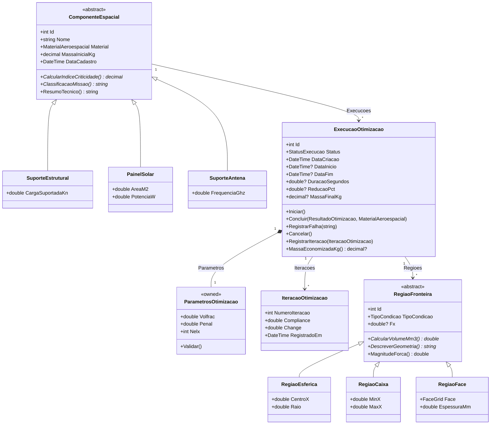
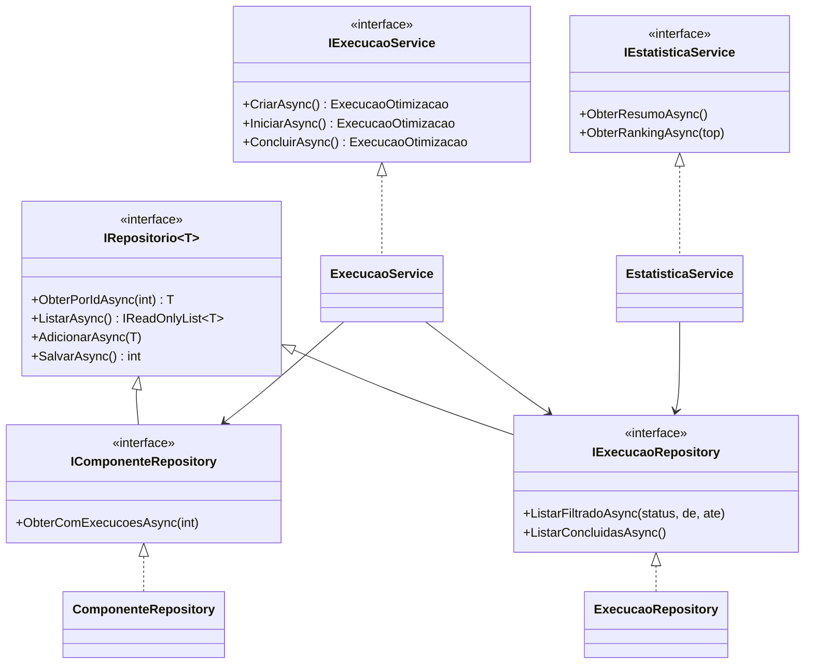
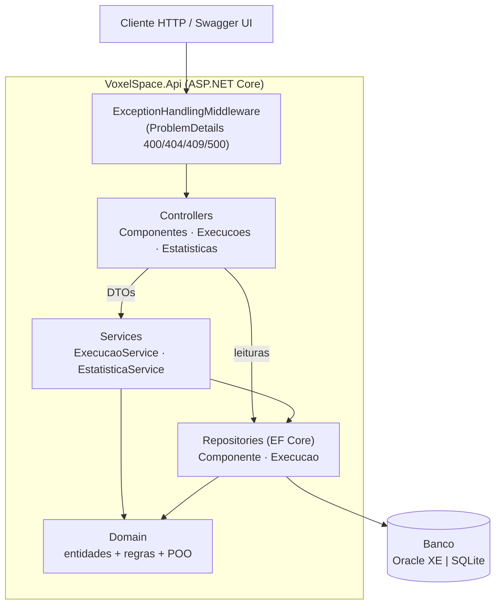
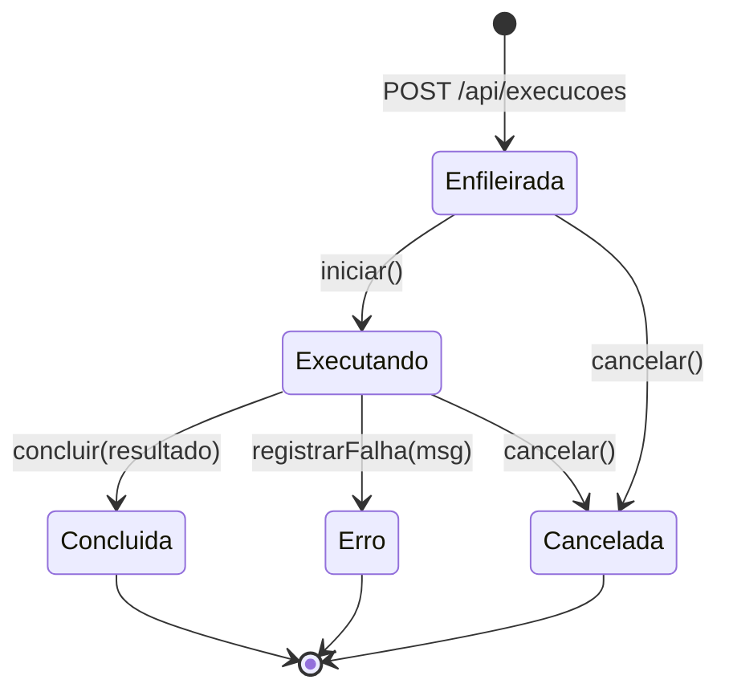
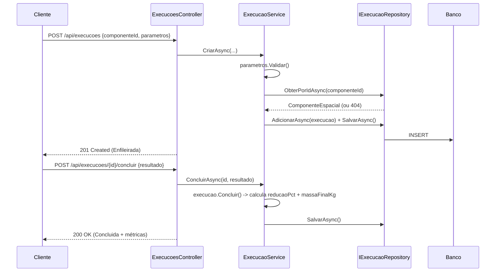

# Voxel API, Otimização Topológica de Estruturas Espaciais

API REST em **.NET / ASP.NET Core** que modela, persiste (**Oracle** via EF Core) e
expõe dados de **otimização topológica de componentes estruturais de satélites e
espaçonaves**.

> Guilherme Oliveira Santana de Almeida - 555180

> Vinicius Monteiro Araújo - 555088

---

## 🛰️ Motivação e conexão com o tema espacial

Lançar massa ao espaço é caro: cada quilograma colocado em órbita baixa (LEO)
custa **milhares de dólares**. Por isso a engenharia aeroespacial usa **otimização
topológica** (método SIMP) para redesenhar peças estruturais, suportes, brackets,
longarinas, estruturas de painel solar, removendo todo material que não contribui
para a rigidez, mantendo a peça capaz de aguentar as cargas de lançamento e operação.

Este projeto nasceu de um sistema real de otimização topológica 3D (engine em
Python que otimiza, inclusive, um `satellite_bracket.stl`). A **VoxelSpace API** é a
camada de dados desse domínio, escrita em C#: ela registra os **componentes**, as
**execuções de otimização** com seus parâmetros e resultados, a **telemetria de
convergência** de cada iteração do solver, as **condições de contorno** (apoios,
forças, regiões que não podem perder material) e calcula **métricas de missão**,
quanta massa foi economizada e **quanto isso representa em custo de lançamento**.

O resultado de engenharia (volume removido) é traduzido em valor de missão
(US$ economizados no lançamento), que é exatamente a pergunta que decide se uma
peça vai ou não para o espaço.

---

## 📦 O que a API disponibiliza

| Recurso | Descrição |
|---|---|
| **Componentes espaciais** | Suportes estruturais, painéis solares, suportes de antena, com material, massa e índice de criticidade de missão (polimórfico). |
| **Execuções de otimização** | Parâmetros do solver (volfrac, penal, rmin, grid), status, timestamps e métricas finais (volume antes/depois, **% de redução**, massa final, watertight). |
| **Telemetria de iterações** | Série temporal da convergência: compliance, change e volume por iteração. |
| **Condições de contorno** | Apoios / forças / keep-solid como geometrias esfera / caixa / face. |
| **Estatísticas de missão** | Reduções média/máxima, taxa de sucesso, tempo médio de solver e **custo de lançamento economizado** (massa salva × US$/kg LEO). |

---

## 🧱 Stack

- **.NET 9** (LTS .NET 8 ou superior) · **ASP.NET Core Web API** (controllers)
- **Entity Framework Core 9** + **Oracle.EntityFrameworkCore**
- **Oracle XE 21c** (via Docker), com **fallback SQLite** para desenvolvimento local
- **Swagger / OpenAPI** (Swashbuckle)

---

## 📁 Estrutura de pastas

```
voxel_api_dash_C#/
├── VoxelSpace.sln
├── docker-compose.yml              # Oracle XE local
├── docs/
│   ├── diagrama-classes.md         # diagrama de classes (Mermaid)
│   ├── arquitetura.md              # arquitetura + máquina de estados + sequência
│   └── evidencias/                 # logs e respostas reais dos endpoints
└── src/VoxelSpace.Api/
    ├── Domain/                     # entidades + POO (herança, abstração, encapsulamento)
    │   ├── Componentes/            #   ComponenteEspacial (abstract) + 3 subclasses
    │   ├── Execucoes/              #   ExecucaoOtimizacao, ParametrosOtimizacao, Iteracao
    │   ├── Regioes/                #   RegiaoFronteira (abstract) + 3 geometrias
    │   ├── Enums/                  #   StatusExecucao, MaterialAeroespacial, ...
    │   └── Common/                 #   MaterialInfo, CalculadoraLancamento, FusoHorario (static)
    ├── Interfaces/                 # IRepositorio<T>, repos, serviços (abstração/DI)
    ├── Infrastructure/
    │   ├── Data/                   #   VoxelDbContext, Migrations, DataSeeder, provider switch
    │   └── Repositories/           #   implementações EF Core
    ├── Services/                   # ExecucaoService, EstatisticaService (regras de negócio)
    ├── Controllers/                # Componentes, Execucoes, Estatisticas
    ├── DTOs/                       # requests/responses (separam API do domínio)
    ├── Middleware/                 # ExceptionHandlingMiddleware (ProblemDetails)
    └── Exceptions/                 # exceções de domínio customizadas
```

---

## ▶️ Como rodar

### Pré-requisitos
- [.NET SDK 9](https://dotnet.microsoft.com/download) (ou 8+)
- [Docker Desktop](https://www.docker.com/products/docker-desktop/) (para o Oracle)

### Oracle XE em Docker

```bash
# 1. sobe o Oracle XE e aguarda ficar "READY"
docker compose up -d
docker compose logs -f db        # espere "DATABASE IS READY TO USE!"

# 2. aplica as migrations e roda a API
cd src/VoxelSpace.Api
dotnet tool restore              # instala o dotnet-ef (manifest local)
dotnet ef database update        # cria as tabelas no Oracle
dotnet run
```

> O provider é escolhido pela chave `DatabaseProvider` (`Oracle` | `Sqlite`) em
> `appsettings.json`. O schema é criado automaticamente e os **dados de seed** são
> inseridos no primeiro start, então todos os endpoints já retornam dados.

### Acessar
- Swagger UI: **http://localhost:5080/swagger** (ou a porta exibida no console)
- Healthcheck: **http://localhost:5080/healthz**

---

## 🔌 Endpoints

| Método | Rota | Função |
|---|---|---|
| GET | `/healthz` | Ping |
| GET / POST | `/api/componentes` | Listar / criar componente (polimórfico por `tipo`) |
| GET / PUT / DELETE | `/api/componentes/{id}` | Obter / atualizar / remover |
| GET / POST | `/api/execucoes` | Listar (filtros `?status=` `?de=` `?ate=`) / criar |
| GET | `/api/execucoes/{id}` | Detalhe completo |
| POST | `/api/execucoes/{id}/iniciar` · `/concluir` · `/cancelar` | Transições de estado |
| GET / POST | `/api/execucoes/{id}/iteracoes` | Curva de convergência / registrar telemetria |
| GET / POST | `/api/execucoes/{id}/regioes` | Condições de contorno |
| GET | `/api/estatisticas/resumo` | Agregados + custo de lançamento economizado |
| GET | `/api/estatisticas/por-material` | Redução média/máx por material |
| GET | `/api/estatisticas/ranking?top=N` | Ranking por % de redução |

Exemplos de requisição/resposta reais estão em [`docs/evidencias/`](docs/evidencias/).

---

## 🗺️ Diagramas

### Diagrama de classes, domínio
Duas hierarquias de herança (componentes e regiões), o agregado de execução com
seu objeto de valor de parâmetros e a telemetria de iterações.



### Interfaces e injeção de dependência



### Arquitetura em camadas



A camada de domínio não depende de nada acima dela. Controllers e serviços
dependem de **interfaces** (`IRepositorio<T>`, `IExecucaoService`,
`IEstatisticaService`), resolvidas por injeção de dependência no `Program.cs`.

### Ciclo de vida de uma execução (máquina de estados)



Transições inválidas (ex.: concluir algo já concluído) lançam
`RegraNegocioException` → HTTP 409. A telemetria de iterações só é aceita no
estado `Executando`.

### Fluxo "criar e concluir uma execução" (sequência)



> Os mesmos diagramas, em arquivos separados, também estão em
> [`docs/diagrama-classes.md`](docs/diagrama-classes.md) e
> [`docs/arquitetura.md`](docs/arquitetura.md).

---

## ✅ Mapa de requisitos atendidos

| Requisito | Onde está |
|---|---|
| **POO** (público/privado/estático, herança) | `ComponenteEspacial`→`SuporteEstrutural`/`PainelSolar`/`SuporteAntena`; `RegiaoFronteira`→`Esferica`/`Caixa`/`Face`; estáticas `MaterialInfo`, `CalculadoraLancamento`, `FusoHorario`; encapsulamento com setters privados em `ExecucaoOtimizacao` |
| **Abstração & Interfaces** | classes `abstract` com métodos abstratos (`CalcularIndiceCriticidade`, `CalcularVolumeMm3`); `IRepositorio<T>`, `IComponenteRepository`, `IExecucaoRepository`, `IExecucaoService`, `IEstatisticaService` via DI |
| **Fluxo, métodos e datas** | métodos coesos; `switch`/`for`/`foreach`/`if` (criação polimórfica, convergência, agregações); `DateTime` UTC, duração calculada, **janela temporal** (`?de/ate`) e **conversão de fuso** (UTC→Brasília) |
| **Tratamento de exceções** | `ExceptionHandlingMiddleware` → ProblemDetails; `catch (DbUpdateException)`, `FormatException`, `ArgumentException`; exceções de domínio (`RecursoNaoEncontradoException`, `RegraNegocioException`, `ParametroInvalidoException`); a API nunca cai |
| **Organização** | estrutura por camadas (acima); este README; diagramas Mermaid; evidências em `docs/evidencias/` |

---
