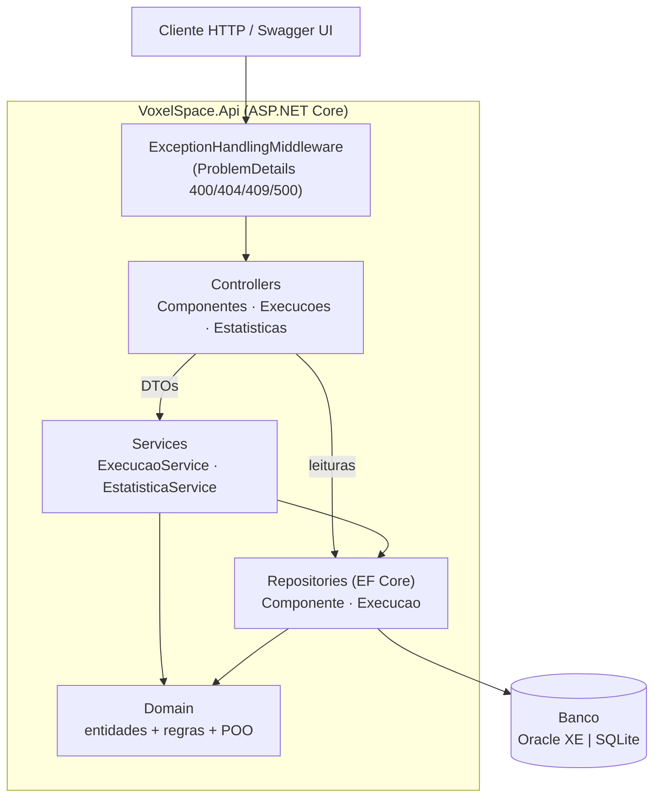
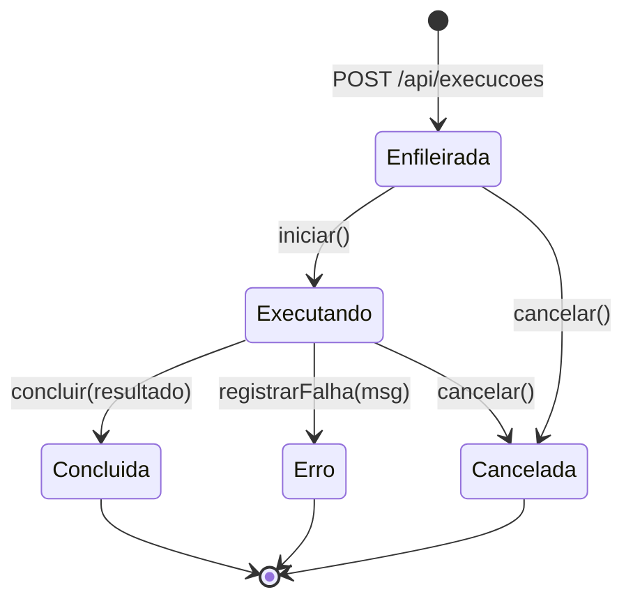
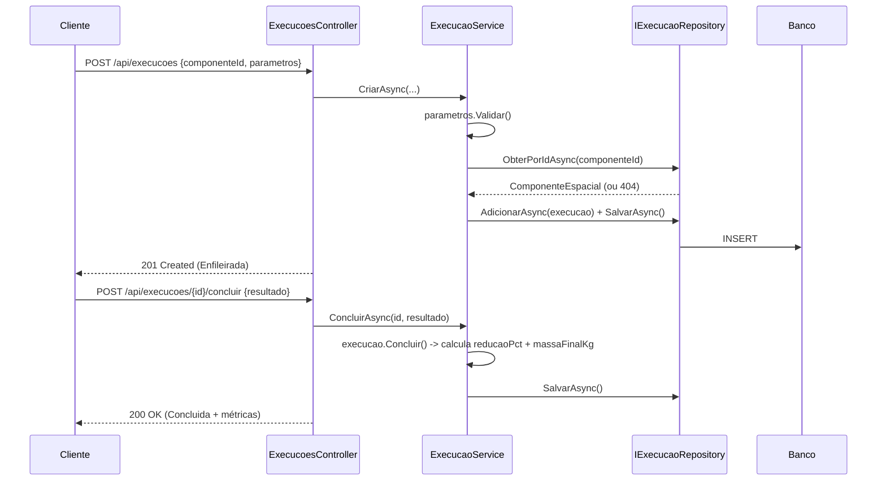

# Arquitetura & Fluxo

## Camadas

A camada de domínio não depende de nada acima dela. Controllers e serviços
dependem de **interfaces** (`IRepositorio<T>`, `IExecucaoService`,
`IEstatisticaService`), resolvidas por injeção de dependência no `Program.cs`.

## Ciclo de vida de uma execução (máquina de estados)

Transições inválidas (ex.: concluir algo já concluído) lançam
`RegraNegocioException` → HTTP 409. A telemetria de iterações só é aceita no
estado `Executando`.

## Fluxo "criar e concluir uma execução"

