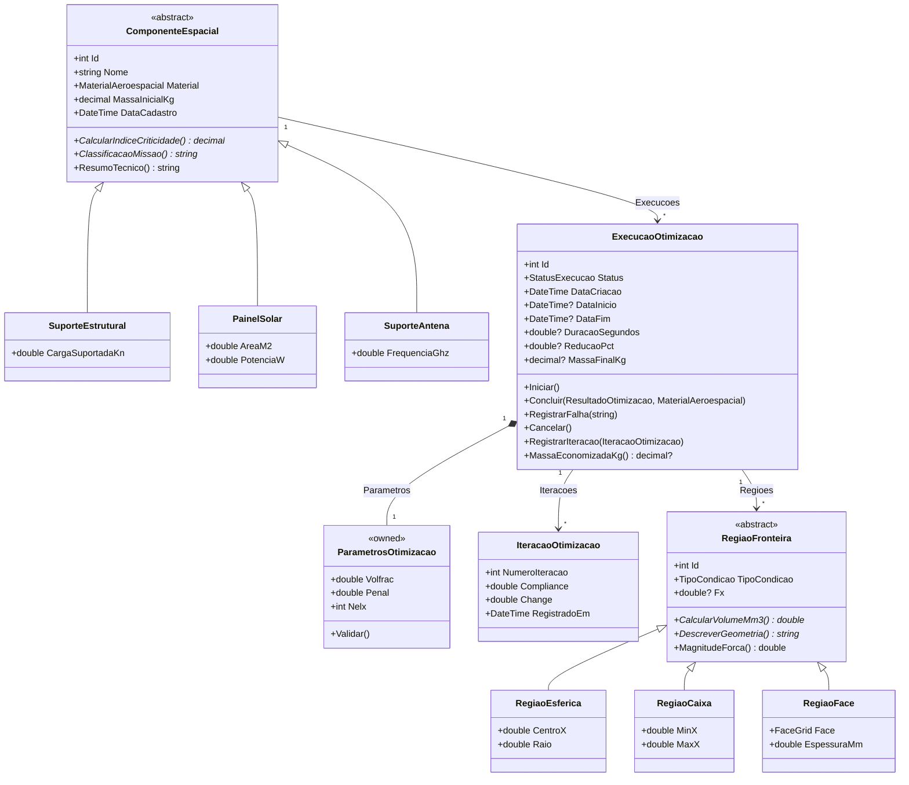
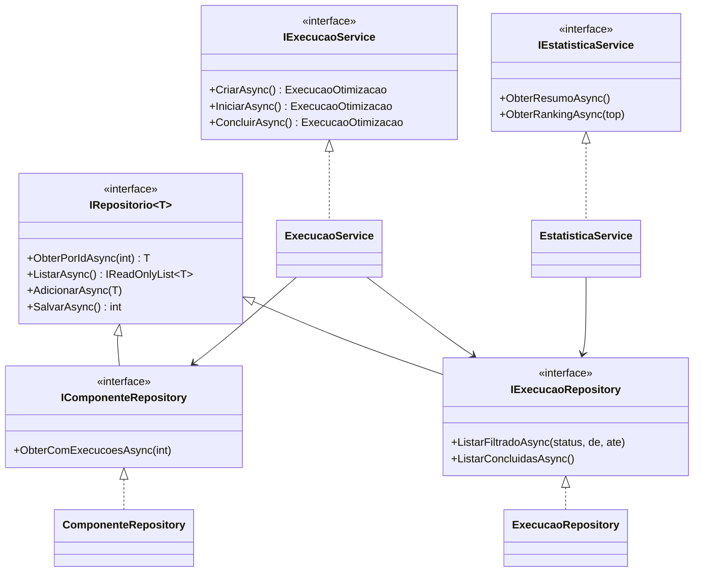

# Diagrama de Classes — Domínio

Duas hierarquias de herança (componentes e regiões), o agregado de execução com
seu objeto de valor de parâmetros e a telemetria de iterações.

## Interfaces e injeção de dependência

